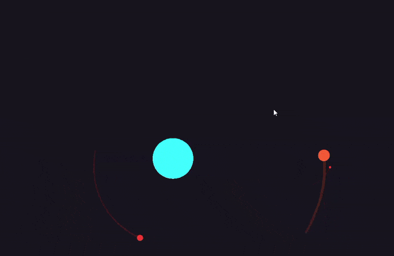

# Orbits! - A Newtonian Gravity Sandbox

**Orbits!** is a 2D gravity simulation built in C++ using [raylib](https://www.raylib.com/). It simulates Newtonian gravitational interactions between multiple bodies and visualizes their motion and orbital paths in real time. It uses **Velocity Verlet** integration for stable, energy-preserving orbits.



# Controls

-   **Left Click Drag** to add a body and set its velocity. **Scroll** to change the mass of the body.
-   **Right Click Drag** to pan the view.
-   **Scroll** to zoom in and out.
-   **Space** to pause the simulation.

# Building

Use CMake to build the project. Raylib is automatically downloaded and built as a dependency.

```bash
mkdir build
cmake -B build -S . # -G "MinGW Makefiles"
cmake --build build	 # or make or mingw32-make
```

orbits.exe will be created in the build directory.

### Building to WebAssembly

To build the project for WebAssembly, you need to use the Emscripten toolchain. First, make sure you have Emscripten installed and set up correctly. Then, you can create a build using the following commands:

```bash
mkdir build
emcmake cmake -B build -S .
cmake --build build
```

This will generate a WebAssembly version of the project that can be run in a web browser.
